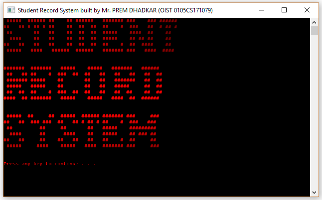
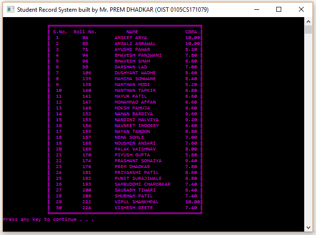
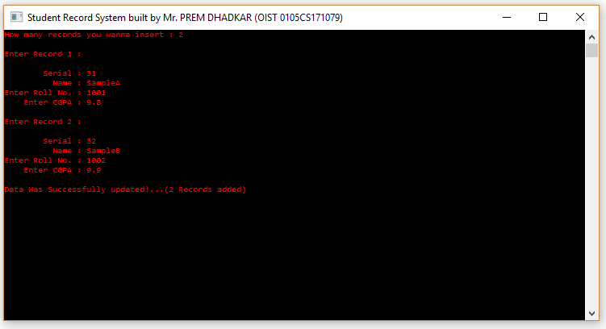
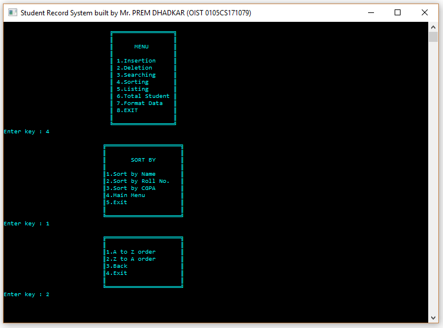

# StudentMGMT

This is a console based application. For demonstrating ussage of file system and sorting-searching algorithms using C language.
 
<a href="https://www.github.com/premdhadkar">Prem Dhadkar</a> developed this application when he was in 3rd semester of his B.tech carrer.

### 1. Welcome Screen

### 2. Dashboard

### 3. Reading data from file

### 4. writing data into file

### 5. searching record

### 6. sorting data

### 7. The Bye-Bye screen 👋

